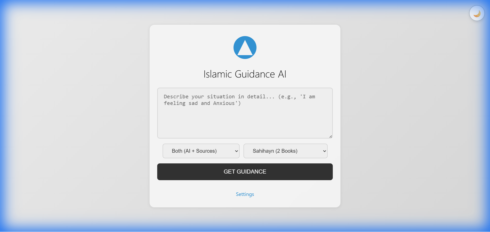
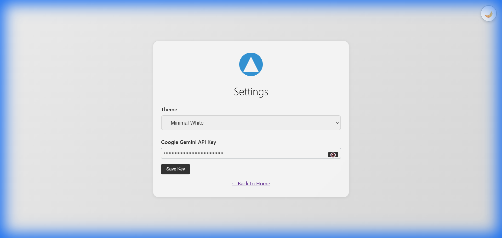
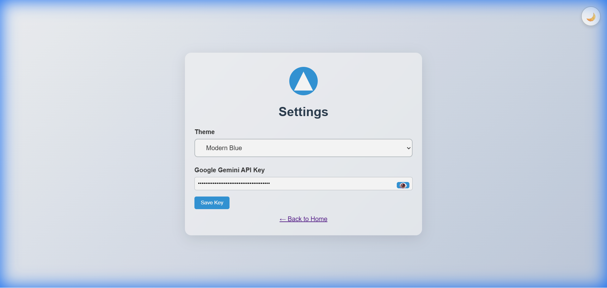
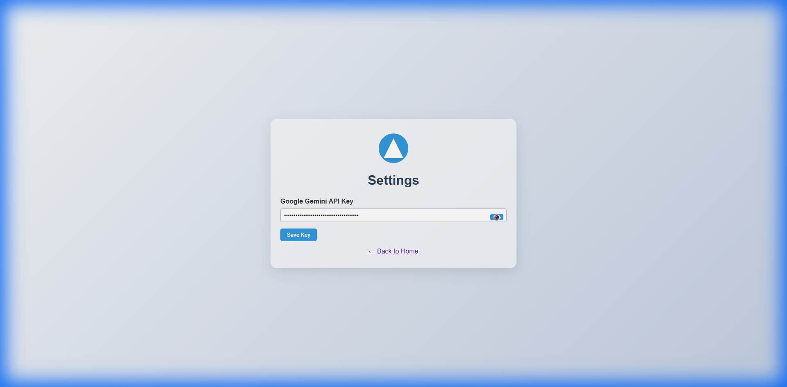
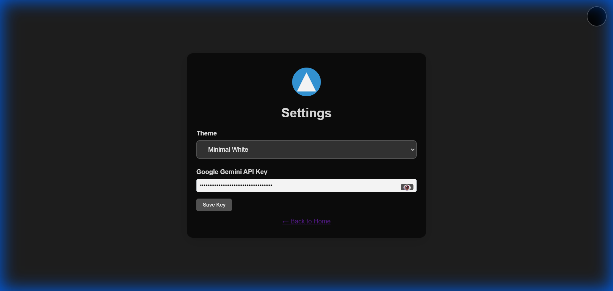

# MuslimGuideAI 🕌

An Islamic guidance application powered by Google's Gemini AI that provides compassionate, contextual Islamic advice based on Quran and Hadith.

**Created by:** Haseeb Mir  
**Email:** haseebmir.hm@gmail.com  
**License:** MIT

## 🚀 Quick Start

### Local Development

1. **Clone the repository**
   ```bash
   git clone <your-repo-url>
   cd MuslimGuideAI
   ```

2. **Set up environment**
   ```bash
   # Copy environment template
   cp .env.example .env
   
   # Edit .env and add your Gemini API key
   # Get key from: https://makersuite.google.com/app/apikey
   ```

3. **Install dependencies**
   ```bash
   pip install -r requirements.txt
   ```

4. **Run the application**
   ```bash
   python -m uvicorn backend.main:app --reload --port 8000
   ```

5. **Open in browser**
   ```
   http://localhost:8000
   ```

## 🌐 Deploy to Vercel

[](https://vercel.com/new/clone?repository-url=<your-repo-url>)

### Quick Deploy Steps:

1. **Push to GitHub**
   ```bash
   git push origin main
   ```

2. **Import to Vercel**
   - Go to [vercel.com/new](https://vercel.com/new)
   - Import your GitHub repository
   - Vercel auto-detects configuration

3. **Add Environment Variable**
   - In Vercel Dashboard: Settings → Environment Variables
   - Add `GEMINI_API_KEY` with your API key
   - Select all environments (Production, Preview, Development)

4. **Deploy!**
   - Click Deploy button
   - Wait 1-2 minutes
   - Visit your live URL

📖 **Detailed deployment guide**: [docs/VERCEL_DEPLOYMENT.md](docs/VERCEL_DEPLOYMENT.md)

## 📁 Project Structure

```
MuslimGuideAI/
├── api/                      # Vercel serverless functions
│   └── index.py             # Entry point for backend
├── backend/                  # FastAPI application
│   ├── main.py              # Main API routes
│   ├── services.py          # Quran/Hadith search
│   └── api_parsers.py       # API response parsers
├── frontend/                 # Static web application
│   ├── index.html           # Main page
│   ├── settings.html        # Settings page
│   ├── styles.css           # Styles
│   ├── script.js            # Main logic
│   └── settings.js          # Settings logic
├── docs/                     # Documentation
│   └── VERCEL_DEPLOYMENT.md # Deployment guide
├── requirements.txt          # Python dependencies
├── vercel.json              # Vercel configuration
└── .env.example             # Environment template
```

## 🎨 UI/UX App Preview

### 🏠 Main Page

#### Traditional Islamic Theme (Default)


**Features Highlighted:**
- 🌙 **Dark Mode Toggle** - Fixed position in top-right corner
- 📝 **Large Resizable Textarea** - 6 rows with vertical resize capability
- 🎯 **Full-Width Button** - Prominent "GET GUIDANCE" action button below textarea
- 🔍 **Source Selector** - Choose AI, External Sources, or Both
- 📚 **Hadith Collection Selector** - Select from 5 collection groups
- 🕌 **Traditional Aesthetics** - Warm beige tones with golden borders (#c9a961)
- 🔗 **Settings Link** - Quick access to configuration

---

### ⚙️ Settings Page

#### Theme Selector & Configuration


**Settings Features:**
- 🎨 **Theme Dropdown** - Select from 3 beautiful themes
- 🔑 **API Key Management** - Securely configure Gemini API key
- 👁️ **Password Toggle** - Show/hide API key visibility
- 💾 **Save Button** - Apply and persist settings
- 🌙 **Dark Mode Toggle** - Consistent across all pages
- ⬅️ **Back to Home** - Easy navigation

**Available Themes:**
1. **Traditional Islamic** (Default) - Beige/brown with serif fonts
2. **Modern Blue** - Contemporary blue gradients
3. **Minimal White** - Clean minimalist design

---

### 🌈 Theme Variations

#### Modern Blue Theme


**Modern Blue Characteristics:**
- 💙 Vibrant blue gradients
- ✨ Glassmorphism design with frosted glass effect
- 🔷 Clean, contemporary aesthetics
- 📱 Modern sans-serif typography

#### Minimal White Theme


**Minimal White Characteristics:**
- ⚪ Ultra-clean gray/white palette
- 🎯 Minimalist Scandinavian design
- 📏 Simple geometric elements
- 💨 Lightweight and fast

---

### 🌙 Dark Mode



**Dark Mode Features:**
- 🌑 **One-Click Toggle** - Instant theme switching
- 👀 **Eye Comfort** - Reduces eye strain in low-light
- 🔄 **Persistent** - Remembers your preference
- 🎨 **Works with All Themes** - Compatible with all 3 color schemes
- ⚡ **Smooth Transitions** - Elegant fade animations

**Dark Mode Specs:**
- Background: `#1e1e1e`
- Cards: `rgba(0,0,0,0.6)`
- Text: `#e0e0e0`
- Inputs: `#333` with `#555` borders

---

### ✨ Key UI/UX Features

- **🎨 Multiple Themes**: 3 distinct visual styles to choose from
- **🌙 Dark Mode**: Toggle for comfortable viewing in any lighting
- **📱 Responsive Design**: Adapts seamlessly to all screen sizes
- **♿ Accessibility**: ARIA labels and keyboard navigation
- **🎭 Smooth Animations**: Transitions and hover effects throughout
- **🔗 Direct Citations**: Clickable links to Quran verses and Hadith sources
- **💬 Dynamic Status Messages**: Real-time feedback during searches
- **🎯 Intuitive Layout**: Logical flow from input to results
- **🔍 Clear Typography**: Readable fonts optimized for each theme

## 🛠️ Technology Stack

- **Backend**: Python, FastAPI, Uvicorn
- **AI**: Google Gemini 2.0 Flash
- **Frontend**: HTML, CSS, Vanilla JavaScript
- **APIs**: Quran.com API, Sunnah.com API
- **Deployment**: Vercel Serverless Functions

## 📝 Environment Variables

| Variable | Description | Required |
|----------|-------------|----------|
| `GEMINI_API_KEY` | Google Gemini API key | Yes |

## 🧪 Testing

### Test API Locally
```bash
# Test guidance endpoint with Hadith collection selection
curl -X POST http://localhost:8000/api/guidance \
  -H "Content-Type: application/json" \
  -d '{
    "query": "I am feeling anxious", 
    "source": "both",
    "hadith_collection": ["eng-bukhari", "eng-muslim"]
  }'

# Test Quran search
curl http://localhost:8000/api/quran/search?keyword=patience

# Test Hadith search
curl http://localhost:8000/api/hadith/search?topic=prayer
```

Once running, visit:
- **Interactive Docs**: http://localhost:8000/docs
- **ReDoc**: http://localhost:8000/redoc

## ⚠️ Important Notes

### For Production (Vercel)
- ✅ Environment variables must be set in Vercel Dashboard
- ✅ File-based logging is disabled (use Vercel logs)
- ✅ API key saving endpoint is disabled for security
- ✅ Static files served by Vercel CDN

### For Development (Local)
- ✅ API keys saved to `.env` file
- ✅ Logs saved to `logs/` directory
- ✅ Hot reload enabled
- ✅ Static files served by FastAPI

## 🤝 Contributing

Contributions are welcome! Please feel free to submit a Pull Request.

## 📄 License
MIT License
Copyright (c) 2025 Haseeb Mir

## 🙏 Acknowledgments

- Google Gemini AI for providing the AI capabilities
- Quran.com for Quran API
- Sunnah.com for Hadith API

## 📞 Support

For deployment issues, see [docs/VERCEL_DEPLOYMENT.md](docs/VERCEL_DEPLOYMENT.md)

---

**Made with ❤️ for the Muslim community**
