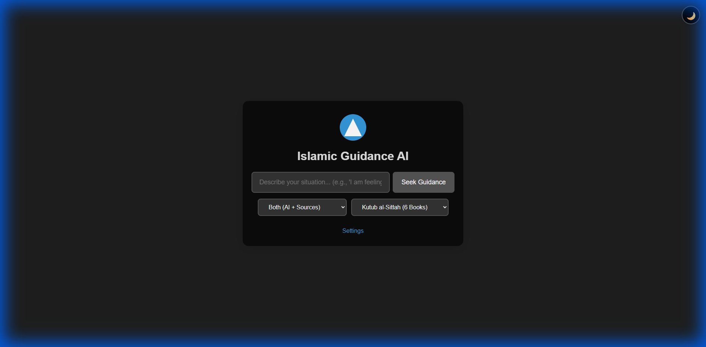

# MuslimGuideAI 🕌

An Islamic guidance application powered by Google's Gemini AI that provides compassionate, contextual Islamic advice based on Quran and Hadith.

## 🚀 Quick Start

### Local Development

1. **Clone the repository**
   ```bash
   git clone <your-repo-url>
   cd MuslimGuideAI
   ```

2. **Set up environment**
   ```bash
   # Copy environment template
   cp .env.example .env
   
   # Edit .env and add your Gemini API key
   # Get key from: https://makersuite.google.com/app/apikey
   ```

3. **Install dependencies**
   ```bash
   pip install -r requirements.txt
   ```

4. **Run the application**
   ```bash
   python -m uvicorn backend.main:app --reload --port 8000
   ```

5. **Open in browser**
   ```
   http://localhost:8000
   ```

## 🌐 Deploy to Vercel

[](https://vercel.com/new/clone?repository-url=<your-repo-url>)

### Quick Deploy Steps:

1. **Push to GitHub**
   ```bash
   git push origin main
   ```

2. **Import to Vercel**
   - Go to [vercel.com/new](https://vercel.com/new)
   - Import your GitHub repository
   - Vercel auto-detects configuration

3. **Add Environment Variable**
   - In Vercel Dashboard: Settings → Environment Variables
   - Add `GEMINI_API_KEY` with your API key
   - Select all environments (Production, Preview, Development)

4. **Deploy!**
   - Click Deploy button
   - Wait 1-2 minutes
   - Visit your live URL

📖 **Detailed deployment guide**: [docs/VERCEL_DEPLOYMENT.md](docs/VERCEL_DEPLOYMENT.md)

## 📁 Project Structure

```
MuslimGuideAI/
├── api/                      # Vercel serverless functions
│   └── index.py             # Entry point for backend
├── backend/                  # FastAPI application
│   ├── main.py              # Main API routes
│   ├── services.py          # Quran/Hadith search
│   └── api_parsers.py       # API response parsers
├── frontend/                 # Static web application
│   ├── index.html           # Main page
│   ├── settings.html        # Settings page
│   ├── styles.css           # Styles
│   ├── script.js            # Main logic
│   └── settings.js          # Settings logic
├── docs/                     # Documentation
│   └── VERCEL_DEPLOYMENT.md # Deployment guide
├── requirements.txt          # Python dependencies
├── vercel.json              # Vercel configuration
└── .env.example             # Environment template
```

## 🔑 Features

- **AI-Powered Guidance**: Uses Google Gemini 2.0 Flash for intelligent responses
- **Quran Integration**: Searches and references relevant Quran verses
- **Hadith Support**: Includes authentic Hadith citations from multiple collections
- **Hadith Collection Selector**: Choose from predefined Hadith book collections:
  - **Sahihayn** (2 books): Sahih al-Bukhari, Sahih Muslim
  - **Sunan Arbaah** (4 books): Abu Dawud, Tirmidhi, Nasai, Ibn Majah
  - **Kutub al-Sittah** (6 books): The Six Authentic Books
  - **Kutub as-Sabiah** (7 books): The Seven Books (includes Muwatta Malik)
  - **Forty Collections** (3 books): Qudsi, Nawawi, Dehlawi
- **Three Search Modes**:
  - Internal: AI's built-in knowledge
  - External: Only Quran/Hadith sources
  - Both: Combined approach
- **Dark/Light Mode**: Toggle between themes for comfortable viewing
- **Responsive UI**: Works on desktop and mobile
- **Serverless**: Scalable deployment on Vercel

## 🎨 UI/UX

### Main Page

The homeinterface features a clean, modern design with:
- **Query Input**: Large textarea for describing your situation
- **Source Selector**: Choose between AI knowledge, external sources, or both
- **Hadith Collection Selector**: Select which Hadith books to consult
- **Dark Mode Toggle**: Switch between light and dark themes
- **Search Status**: Real-time feedback showing: "Understanding your problem...", "Searching Quran...", "Consulting Hadith books (Sahih al-Bukhari, Sahih Muslim)..."
- **Results Display**: Formatted guidance with clickable citations



### Settings Page

Configure your API settings through an intuitive interface:
- **API Key Management**: Securely save your Gemini API key
- **Key Visibility Toggle**: Show/hide API key while entering
- **Success/Error Feedback**: Clear status messages
- **Back to Home**: Easy navigation


### Key Features Showcase

- **Glassmorphism Design**: Modern frosted glass effect with subtle backdrop blur
- **Smooth Animations**: Transitions and hover effects for enhanced UX
- **Consultation Messages**: Dynamic status showing exactly which Hadith books are being searched
- **Proper Citations**: Direct links to specific verses (quran.com) and Hadiths (sunnah.com)
- **Responsive Layout**: Adapts seamlessly to different screen sizes
- **Accessibility**: ARIA labels and keyboard navigation support

## 🛠️ Technology Stack

- **Backend**: Python, FastAPI, Uvicorn
- **AI**: Google Gemini 2.0 Flash
- **Frontend**: HTML, CSS, Vanilla JavaScript
- **APIs**: Quran.com API, Sunnah.com API
- **Deployment**: Vercel Serverless Functions

## 📝 Environment Variables

| Variable | Description | Required |
|----------|-------------|----------|
| `GEMINI_API_KEY` | Google Gemini API key | Yes |

## 🧪 Testing

### Test API Locally
```bash
# Test guidance endpoint with Hadith collection selection
curl -X POST http://localhost:8000/api/guidance \
  -H "Content-Type: application/json" \
  -d '{
    "query": "I am feeling anxious", 
    "source": "both",
    "hadith_collection": ["eng-bukhari", "eng-muslim"]
  }'

# Test Quran search
curl http://localhost:8000/api/quran/search?keyword=patience

# Test Hadith search
curl http://localhost:8000/api/hadith/search?topic=prayer
```

Once running, visit:
- **Interactive Docs**: http://localhost:8000/docs
- **ReDoc**: http://localhost:8000/redoc

## ⚠️ Important Notes

### For Production (Vercel)
- ✅ Environment variables must be set in Vercel Dashboard
- ✅ File-based logging is disabled (use Vercel logs)
- ✅ API key saving endpoint is disabled for security
- ✅ Static files served by Vercel CDN

### For Development (Local)
- ✅ API keys saved to `.env` file
- ✅ Logs saved to `logs/` directory
- ✅ Hot reload enabled
- ✅ Static files served by FastAPI

## 🤝 Contributing

Contributions are welcome! Please feel free to submit a Pull Request.

## 📄 License

[Your License Here]

## 🙏 Acknowledgments

- Google Gemini AI for providing the AI capabilities
- Quran.com for Quran API
- Sunnah.com for Hadith API

## 📞 Support

For deployment issues, see [docs/VERCEL_DEPLOYMENT.md](docs/VERCEL_DEPLOYMENT.md)

---

**Made with ❤️ for the Muslim community**
